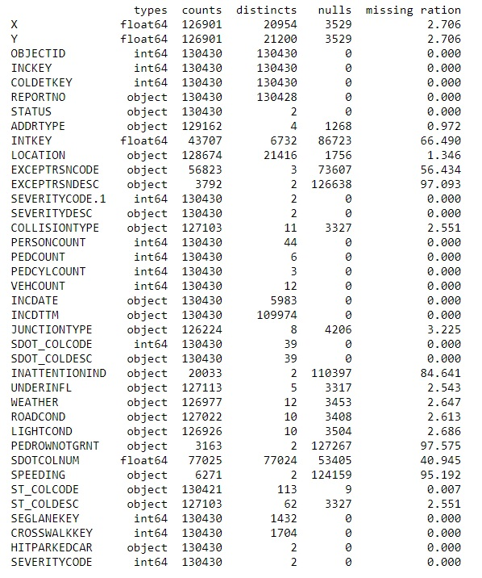
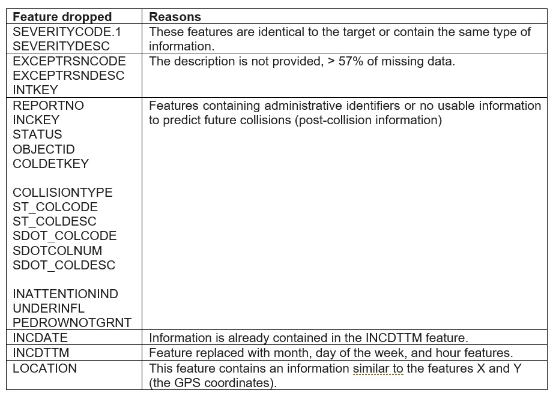
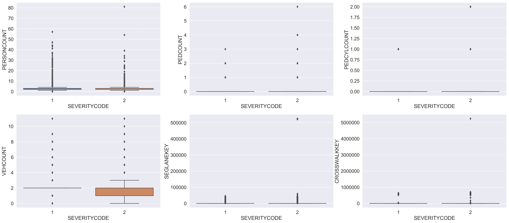

# The capstone project

## Introduction 
### Background
The Seattle Police Department (SPD) provides collisions records since 2004, containing the severity of each road collision (0 property damage/ 1 personal injury) with additional information, such as the location, the weather and road conditions, and more. 
Preventing collisions is a major concern for public authorities. Therefore, it is important for the SPD to accurately predict whatever a serious accident will occur given all available data. It is also important to identify the factors causing serious accidents, as these could be eliminated or mitigated before a collision occurs.

### Problem
This project aims to predict the severity of a collision given other factors, such as the wheatear condition, the road condition, the number of vehicles, and persons in the road.

### Interest
Predicting the severity of a collision can be of interest for a warning system. The SPD could issue a warning on the highway signs when a serious accident is predicted (severity 1, personal injury). Such information allows the drivers to pay more attention when such notification is issued. 

## Data
### Sources
In this study, the Seattle collisions records from 2004 to 2020 were used. The data can be found in https://data-seattlecitygis.opendata.arcgis.com/. The description of each feature (metadata) can be found here https://www.seattle.gov/Documents/Departments/SDOT/GIS/Collisions_OD.pdf
The source contains a mixture of categorical and continuous variables.

### Feature selection

The entire set was immediately divided into a train and test set. Decisions on feature dropping and data cleaning were taken by analyzing only the test set and applied to both the train and test sets. This choice was motivated to avoid lookahead bias. Table 1 shows a summary of the test set.

[Table 1. Train set summary]

Table 2 summarizes the decisions taken for selecting the features.

First, the features identical to the target or containing the same type of information were eliminated, for preventing the models to use the target as a feature.

Second, some features are missing an appropriate description and have a large percentage of missing values. These features were dropped.

Third, features containing administrative information or collision details available only after a collision occurred were eliminated. 

Fourth, the INCDATE feature was eliminated as contains the collision date as in the INCDTTM feature. 

Fifth, the location feature was eliminated because it contains information that is similar to the X and Y GPS coordinates.

[Table 2. Dropped features and reasons for dropping]

### Data cleaning

After dropping the features, several categorical features had a large ratio of missing values: INATTENTIONIND, PEDROWNOTGRNT, SPEEDING. These features contain only the value Y and nan (not a number). For them, it was speculated that NaN corresponds to no (N), as the SPD agent could have decided not to fill these fields when the condition was negative. All Ns were converted to 0 and all Y to 1, transforming these three features into numerical features. 

The feature UNDERINFL contains 4 values: N, 0, Y, 1. In this case, N was converted to 0 and Y to 1, also transforming UNDERINFL into a numerical feature. For UNDERINFL, Y was not the only entry present in the original dataset, and NaN entries were not assumed to be an indication of a negative condition.

LIGHTCOND, ROADCOND, and WEATHER features already contain a value ‘Unknown’. For them, nan entries were converted to ‘Unknown’.

The number of missing values in the JUNCTIONTYPE feature was reduced by using valid JUNCTIONTYPE entries of other records with the same X and Y coordinate values. This decreased the number of missing values for JUNCTIONTYPE from 3.2% to 1.3% in the training dataset and from 3.3% to 1.6% in the test dataset. The

As most predictive models only accept numerical values, the information of the INCDTTM feature was converted into 4 newly created numerical features: the year, the month, the day of the week, and the hour. 

Box plots where used to detect the outliers for the numerical features with a large range of variation (Figure 1). The collisions involving up to 81 persons, with a lane segment greater than 525241 and a crosswalk number larger than 5239700 are outliers and were eliminated. In total, only 3 records of the train set were eliminated.

[Figure 1. Box plots for numerical features with a large range of variation]

 