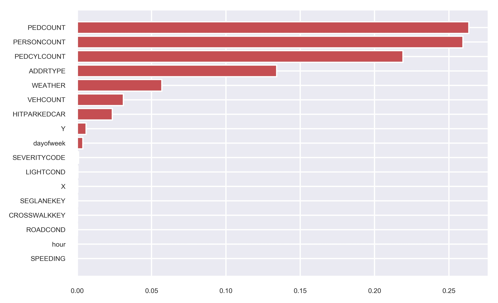

# The capstone project

## Introduction 
### Background
The Seattle Police Department (SPD) provides road collisions records since 2004. The records describe the severity of each collision (0 property damage/1 personal injury) with additional information. 

Preventing road collisions is a major concern for public authorities. Therefore, it is important to accurately predict whatever a serious accident will occur. It is also important to identify the factors causing serious accidents, as these could be eliminated or mitigated.

### Problem
This project aims to predict the severity of a collision given other factors, such as the wheatear condition, the road condition, the number of vehicles involved, and the number of persons on the road.

### Interest
A model predicting the severity of collisions can be used for a warning system. The SPD could issue a warning on road signs when a serious accident is predicted (severity 1, personal injury), to inform the drivers to pay more attention while driving. 

## Data

### Sources

In this study, the SPD records from 2004 to 2020 were used. The data can be found [here](https://data-seattlecitygis.opendata.arcgis.com/). The data source contains a mixture of categorical and continuous variables. The description of each feature (metadata) can be found [here](https://www.seattle.gov/Documents/Departments/SDOT/GIS/Collisions_OD.pdf).

### Feature selection
The entire set was immediately divided into a train and test set. Decisions on feature selection and data cleaning were taken by analyzing exclusively the test set and were applied thereafter on both sets, to avoid the look-ahead bias. Table 1 shows a summary of the train set.

[Table 1. A summary of the train set]

+ First, the features identical to the target or containing the same information were eliminated.
+ Second, some features are missing an appropriate description and have a large percentage of missing values. These features were dropped.
+ Third, features containing administrative information or post-collision details were eliminated. Post-collision data were considered not relevant for predicting feature collisions because they will not be available when predicting. 
+ Fourth, the INCDATE feature was eliminated because the collision date was already contained in the INCDTTM feature. 
+ Fifth, the location feature was eliminated because it contains information similar to the X and Y GPS coordinates.

[Table 2. Dropped features and reasons for dropping]

### Data cleaning

Several other categorical features have a large ratio of missing values: INATTENTIONIND, PEDROWNOTGRNT, SPEEDING. These features contain only the value Y for "yes" and nan for "not a number". For them, it was speculated that a nan corresponds to "no" (N) and not to a "yes", as the SPD agent could have decided to not fill these fields in case of a negative condition. All nans were converted to 0 and all Y to 1, transforming these three categorical features into numerical features. 

UNDERINFL contains 4 values: N, 0, Y, 1. In this case, N was converted to 0 and Y to 1, transforming UNDERINFL into a numerical. For UNDERINFL, Y was not the only valid value present in the original dataset, and nan entries were not assumed to indicate a negative condition.

LIGHTCOND, ROADCOND, and WEATHER already contain a value ‘Unknown’. For them, nan entries were converted to ‘Unknown’.

Some of the JUNCTIONTYPE missing values were substituted with the valid values of records having the same X and Y coordinates, decreasing the number of missing JUNCTIONTYPE values from 3.2% to 1.3% in the train set and from 3.3% to 1.6% in the test set.

As most predictive models only accept numerical values, the information of the time feature (INCDTTM) was converted into 4 numerical features, namely the year, the month, the day of the week, and the hour. 

Box plots were used to detect extreme outliers for features with a large range of variation (Figure 1). The collisions involving up to 81 persons, in a lane segment greater than 525241 and a crosswalk number larger than 5239700 are outliers and were eliminated. In total, only 3 records were dropped from the train set.

[Figure 1. Box plots for numerical features with a large range of variation]

Table 3 summarizes the train set after feature selection and data cleaning, and conversion of categorical features into numerical ordinal features. 

 
[Table 3. Train set summary after feature dropping and data cleaning]

## Methodology

### Exploratory Data Analysis

For each feature, the records in the train set were grouped by target value (0/1) to assess if the mean group values were significantly different from each other (t-test with a p-value <0.05). It was found that the mean group values were different, except for the month feature (Figure 2). This result was unexpected because severe accidents with personal injuries were expected to occur more frequently in fall or winter, with worse weather conditions.

[Figure 2. Bar chart for the month feature grouped by the severity code]

As expected, collisions involving a pedestrian or a bicycle more frequently result in a personal injury compared to collisions with no pedestrian or bicycle involved (Figures 3 and 4). When forecasting the severity of a collision, it will be important to take into account the presence of persons and bicycles on the road (e.g. at pedestrian crossings).

[Figure 3.  Bar chart for PERSONCOUNT feature (the number of persons involved in the collision) grouped by the severity code]

[Figure 4. Bar chart for PEDCYLCOUNT feature (the number of cyclists involved in the collision) grouped by the severity code]

Before jumping into modeling, a correlation analysis was performed, to identify large correlations (absolute correlation value > 0.9). If a feature is strongly correlated to another it can be dropped to reduce the dimensionality of the feature set. The feature correlation matrix is shown in Figure 5. ADDRTYPE and JUNCTIONTYPE are strongly correlated (-0.92). JUNCTIONTYPE was dropped, having a larger amount of missing data in the original dataset.

[Figure 5. Feature correlation matrix]

 ### Modelling

The train set is strongly unbalanced: 69.8% of the records have a target value equal to 1. The weights were set inversely proportional to class frequencies to avoid fitting only the most frequent class (severity 1). Before modeling, the feature values in the train and test set were standardized with the means and standard deviations of the train set.

Four models were fitted and evaluated on the test set:

+ A Decision tree classifier: the node splitting criterion (Gini or entropy) and the tree max depth were tuned.
+ An XGBoost classifier: the gamma parameter and the tree max depth were tuned.
+ A Random forest:  the node splitting criterion (Gini or entropy) and the tree max depth were tuned.
+ A soft voting classifier: built using the probabilities computed from the best models above.

The parameters were tuned using the average negative log loss score computed from a 3 fold cross-validation. The logarithmic loss was used as a score function because it puts more emphasis on probabilities than other metrics. The Optuna hyperparameter optimization framework was used to automate the search of the best hyperparameters.

## Results

Table 4 shows the metrics on the test set for each model. In this study, it is more important to correctly predict a collision causing a personal injury than one causing property damage. Under this constrain, the decision tree classifier is the best candidate, with an accuracy of 76% for type 2 collisions.

Figure 6 shows the importance of each feature for the decision tree classifier. As can be seen, the features indicating the presence of persons on the road have the largest importance in determining the type of collision, followed by the address type, the weather condition, and the number of vehicles involved. 

[Table 4. Model metrics computed on the validation set. The largest values are in red]

[Figure 6. Decision tree feature importances]

 ## Discussion

From the results, it is clear that models with high accuracy on type 1 collisions have lower accuracy on type 2 collisions. The voting model is the best model for type 1 collisions and has the best accuracy and f1 scores, but has a lower accuracy for type 2 collisions. The decision tree has the opposite behavior.  

The most important factor determining type 2 collision is the presence of persons on the road. This result makes sense and was anticipated in the exploratory data analysis.

## Conclusions

In this study, the  Seattle Police Department collisions records were analyzed to build a predictive model of collision types. The predictive model can be used to issue a warning to drivers when a serious accident is predicted.

After data cleaning and selection, a decision tree classifier was found to be able to predict collisions causing personal injuries with 76% accuracy. Collisions involving personal injuries are more likely to happen in areas with more people on the road (such as pedestrian crossings). Road signs issuing warnings could be installed in these areas first.

The data set was strongly unbalanced towards collisions with severity code 1 (property damage). Additional records with severity code 2 (personal injuries) would help to improve the model performance for this type of accident.

For some features with a large number of missing values, the description was missing. In these cases, a description would have been useful during the feature selection process.