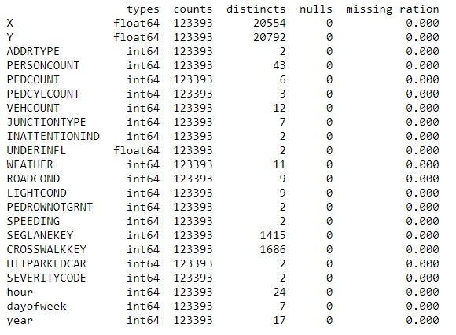
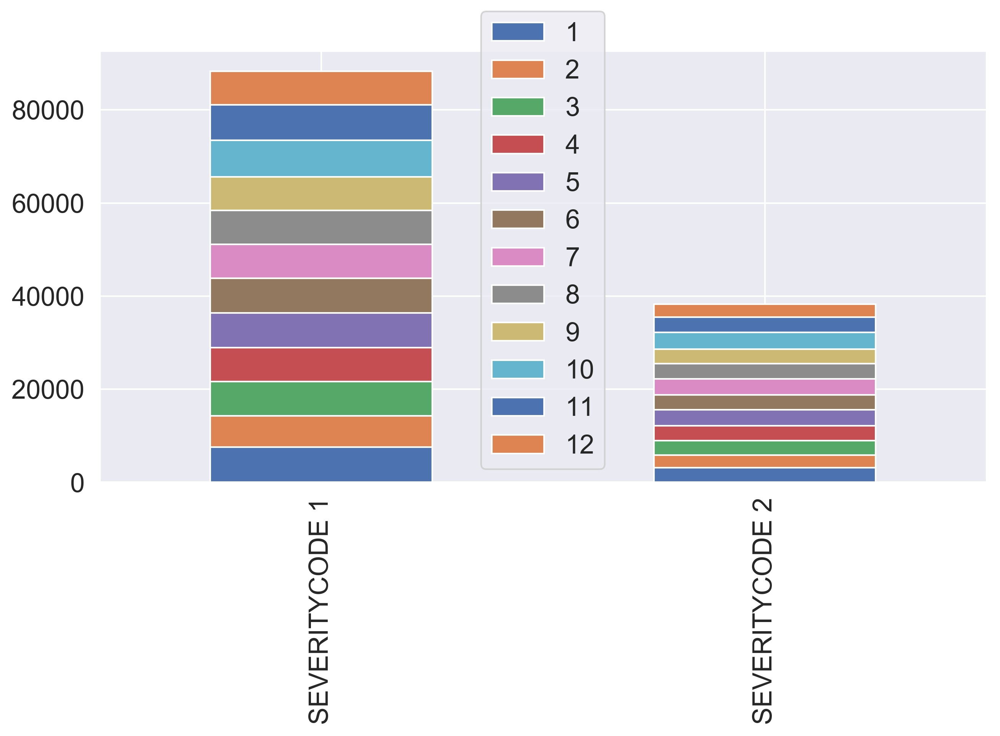
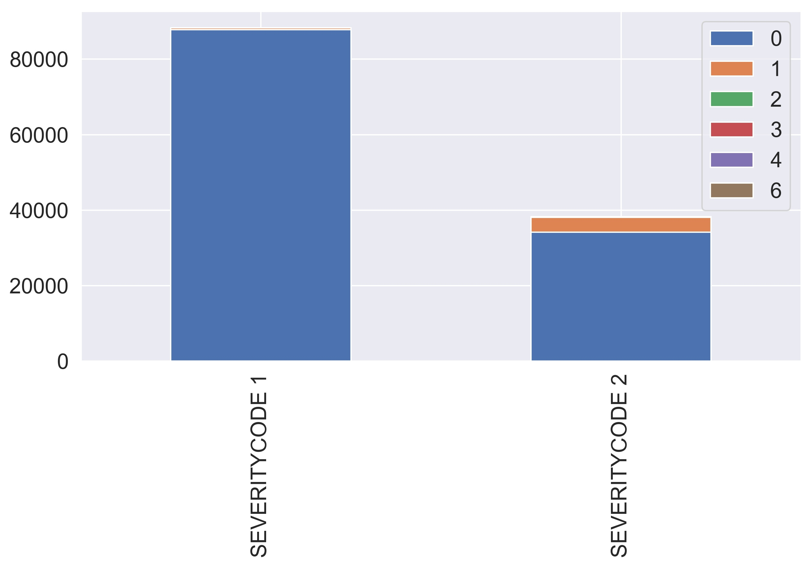
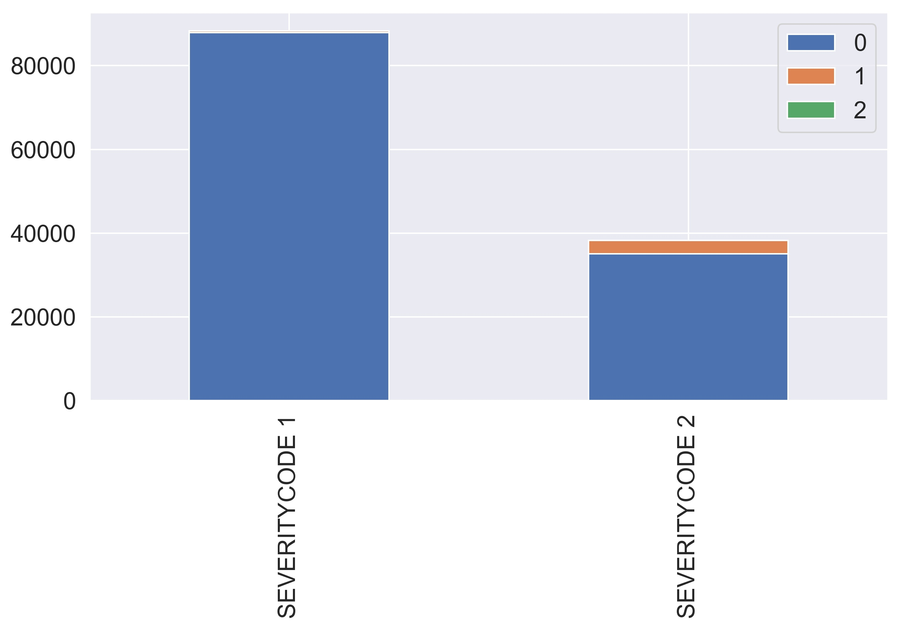
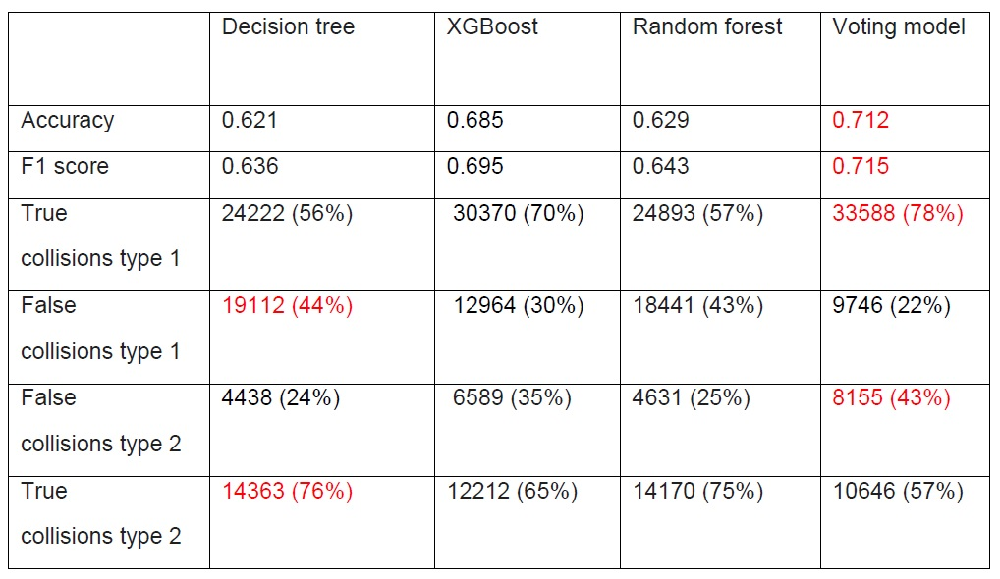

# The capstone project

## Introduction 
### Background
The Seattle Police Department (SPD) provides road collisions records since 2004, containing the severity of each collision (0 property damage/ 1 personal injury) with additional information, such as the location, the weather road conditions, and more. 
Preventing road collisions is a major concern for public authorities. Therefore, it is important for the SPD to accurately predict whatever a serious accident will occur given all available data. It is also important to identify the factors causing serious accidents, as these could be eliminated or mitigated before a collision occurs.

### Problem
This project aims to predict the severity of a collision given other factors, such as the wheatear condition, the road condition, the number of vehicles, and number of persons on the road.

### Interest
Predicting the severity of a collision can be of interest for a warning system. The SPD could issue a warning on the highway signs when a serious accident is predicted (severity 1, personal injury), to inform the drivers to pay more attention when the notification is issued. 

## Data

### Sources

In this study, the SPD records from 2004 to 2020 were used. The data can be found [here](https://data-seattlecitygis.opendata.arcgis.com/). The description of each feature (metadata) can be found [here](https://www.seattle.gov/Documents/Departments/SDOT/GIS/Collisions_OD.pdf)
The source contains a mixture of categorical and continuous variables.

### Feature selection
The entire set was immediately divided into a train and test set. Decisions on feature selection and data cleaning were taken by analyzing exclusily the test set and were applied therafter on both train and test sets. This choice was taken to avoid the look-ahead bias. Table 1 shows a summary of the test set.

[Table 1. Train set summary]

Table 2 summarizes the decisions taken for selecting the features.

First, the features identical to the target or containing the same information information were eliminated from the feature set.

Second, some features are missing an appropriate description and have a large percentage of missing values. These features were dropped.

Third, features containing administrative information or collision details available only after a collision occurred were eliminated. Post-collision features were deemed not relavant for predicting feature collisions. 

Fourth, the INCDATE feature was eliminated as contains the collision date as the INCDTTM feature. 

Fifth, the location feature was eliminated because it contains an information similar to the X and Y GPS coordinates.

[Table 2. Dropped features and reasons for dropping]

### Data cleaning

After dropping the features as described above, several other categorical features had a large ratio of missing values: INATTENTIONIND, PEDROWNOTGRNT, SPEEDING. These features contain only the value Y for "yes" and nan for "not a number". For them, it was speculated that nan corresponds to no (N) and not to a yes, as the SPD agent could have decided not to fill these fields when the condition was negative. All nans were converted to 0 and all Y to 1, transforming these three categorical features from to numerical ones. 

The UNDERINFL feature contains 4 values: N, 0, Y, 1. In this case, N was converted to 0 and Y to 1, transforming UNDERINFL into a numerical feature. For UNDERINFL, Y was not the only entry present in the original dataset, and nan entries were not assumed to indicate a negative condition.

LIGHTCOND, ROADCOND, and WEATHER features already contain a value ‘Unknown’. For them, nan entries were converted to ‘Unknown’.

The number of missing values in the JUNCTIONTYPE was reduced by using the first valid JUNCTIONTYPE entries of other records with the same X and Y coordinates. This decreased the number of missing values for JUNCTIONTYPE from 3.2% to 1.3% in the train set and from 3.3% to 1.6% in the test set.

As most predictive models only accept numerical values, the information of the INCDTTM feature was converted into 4 numerical features, namely the year, the month, the day of the week, and the hour. 

Box plots were used to detect the outliers for features with a large range of variation (Figure 1). The collisions involving up to 81 persons, in a lane segment greater than 525241 and a crosswalk number larger than 5239700 are clearly outliers and were eliminated. In total, only 3 records of the train set were dropped.

[Figure 1. Box plots for numerical features with a large range of variation]

Table 3 summarizes the train set after feature selection and data cleaning, and conversion of categorical features into numerical ordinal features. 

 
 [Table 3. Train set summary after feature dropping and data cleaning]

 ## Methodology

 ### Exploratory Data Analysis

For each feature, the records in the train set were grouped by the target value (0/1) to assess if the means group values were significantly different (t-test with a p-value <0.05). It was found that the mean group values were different, except for the month feature. For this reason, the month was dropped (Figure 2). This result was unexpected because severe accidents with personal injuries were expected to occur more frequently in fall or winter when the wheater conditions can be worse.

[Figure 2. Bar chart for month feature grouped by severity code]

As expected, collisions involving a pedestrian or a bicycle more frequently results in a personal injury compared to collisions with no pedestrian or bicycle involved (Figure 3 and 4). When forecasting the severity of a collision, it is important to take into account the presence of persons and bicycles on the road (such as at pedestrian of bicycle crossings).

[Figure 3. Bar chart for PERSONCOUNT feature grouped by severity code]

[Figure 4. Bar chart for PEDCYLCOUNT feature grouped by severity code]

Before jumping into modeling, a correlation analysis was performed, to identify strongly correlated features (absolute correlation value > 0.9). If one feature is strongly correlated to another it can be dropped to reduce the dimensionality of the feature set. 
The feature correlation matrix computed from the train set is shown in Figure 5. Only ADDRTYPE was found to be strongly correlated to JUNCTIONTYPE (-0.92). Since JUNCTIONTYPE had more missing values than ADDRTYPE in the initial dataset, the JUNCTIONTYPE feature was dropped.

[Figure 5. Feature correlation matrix]

 ### Modelling

The train set is strongly unbalanced: 69.8% of the records have a target value equal to 0. It was choosen to set the weights inversely proportional to class frequencies during training. This chociche mitigates the model bias towards predicting only the most frequent class, with the aim of maximizing model accuracy.

Before modeling, the feature values in the train and test set were also scaled using the feature's train set mean and standard deviation.

Four models were fitted to the train set and compared using the test set:

* A Decision tree classifier: node splitting criterion (Gini or entropy) and tree max depth were tuned.
* A XGBoost classifier: gamma parameter for the tree splitting and the tree max depth were tuned.
* A Random forest: node splitting criterion (Gini or entropy) and tree max depth were tuned.
* A Soft voting classifier: build using the probabilities computed from tree best models above.

The parameters were tuned using the average negative log loss score computed with a 3 fold cross-validation method on the train data. The logarithmic loss was used as score function because it puts more emphasis on probabilities than other metrics.
The optuna hyperparameter optimization framework was used to automate the hyperparameter search of each model.

 ## Results

Table 4 shows the metrics on the test set for each model. In this case, it is more important to correctly predict a collision causing a personal injury that correctly predicts a collision causing property damage. The decision tree classifier correctly predicts more accurately severy 2 collisions (76% of all severity 2 collisions in the test set).

 ## Discussion

From the results, it is clear that models with high accuracy on severity 1 collisions tend to have lower accuracy on severity 2 collisions. XGBoost is the best model for severity 1 collisions and has the best accuracy and f1 score, but has a lower accuracy for severity 2 collisions. The decision tree has the opposite behavior. The voting model has an average performance for both collision types, between the XGBoost and the decision tree performances.  

 ## Conclusions

In this study, the  Seattle Police Department collisions records were analyzed to build a model that predicts collisions causing personal injuries. 
The predictive model can be used to issue a warning to the drivers when a serious accident is predicted.

After data cleaning and selecting only the feature describing the pre-collision conditions, a decision tree classifier was found to be able to predict severe accidents with 76% accuracy.
The data set was strongly unbalanced towards collisions with severity code 1 (property damage). Additional records with severity code 2 (personal injuries) would help to improve the model performance for this type of accidents.
For some feature with a large number of missing values the description was missing. In these cases, a description would have been useful during the feature selection process, to decide if the feature is relevant.

